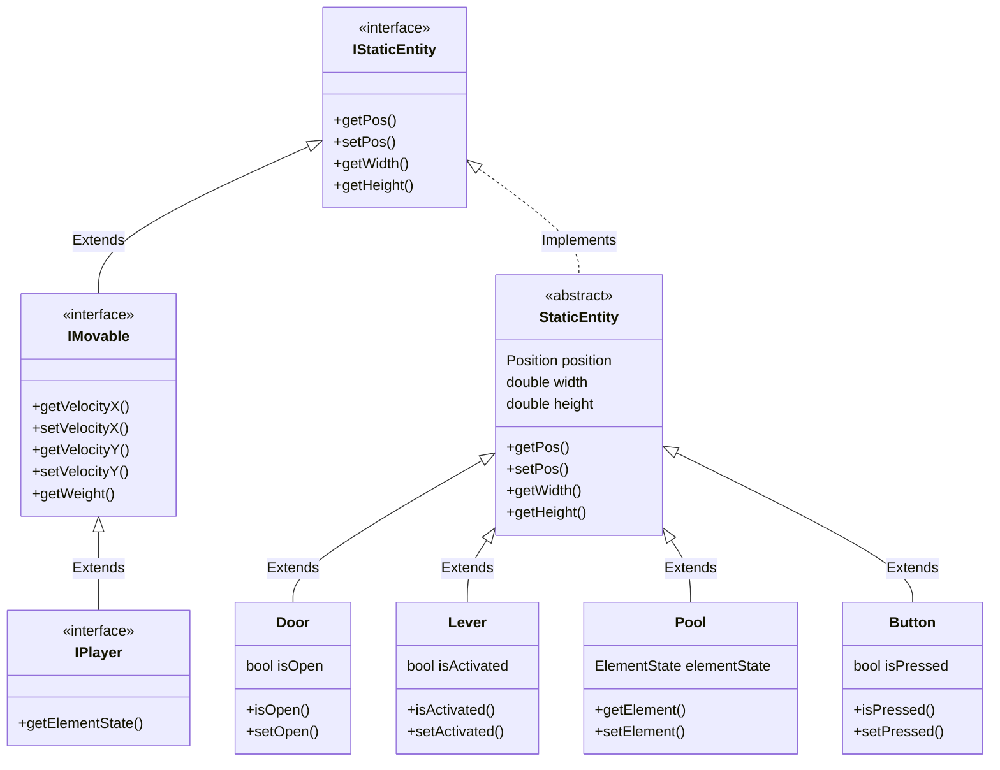

# Konsept
Spill inspirert av Fireboy and watergirl. Prøver å lage en egen liten vri

Ansvarsfordeling
    Magnus
        - Boy og girl klassen
        -
    Brage
        - Lage meny
        - Animasjoner
    Petter(Git ansvarlig)
        - Elementer
        - 
    Oscar
        - Brettlogikk
## UML diagram

Innlevering:
https://git.app.uib.no/inf112/25v/inf112-25v/-/wikis/prosjekt/innlevering

                

