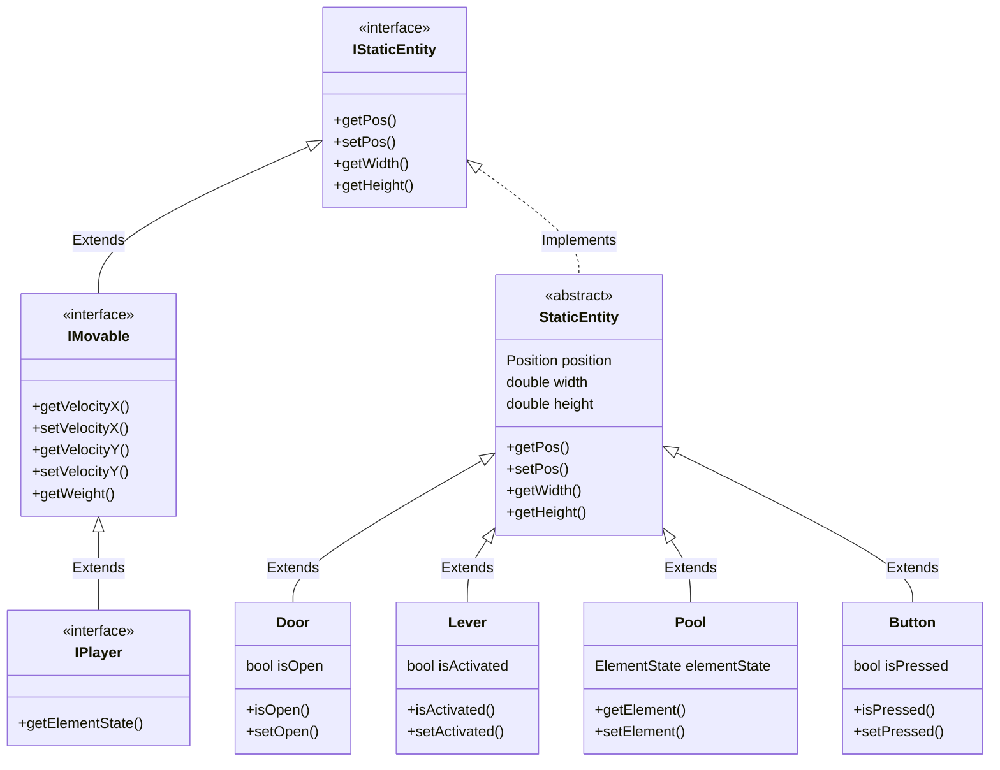

# Fireboys

## Team og prosjektinfo
- **Prosjekt:** Fireboy & Watergirl (inspirert av Fireboy and Watergirl (2009))
- **Teamnavn:** Fireboys
- **Teammedlemmer:** Petter, Brage, Oscar, Magnus

## Kort beskrivelse av spillet
Fireboy & Watergirl er et 2D-plattformspill med meny, nivåvalg og enkel fysikk. Spilleren styrer en karakter gjennom brett med vegger, bokser, knapper, dører, spaker og farlige elementer. Målet er å bevege seg trygt gjennom nivået og nå måltilstand uten å dø.

## UML diagram


## Styring (tastetrykk)
### Menyer (hovedmeny / level select / settings)
- `W` eller `Pil opp`: flytt markør opp
- `S` eller `Pil ned`: flytt markør ned
- `Enter` eller `Mellomrom`: velg
- `Esc`: tilbake til hovedmeny

### I spill (PLAYING)
- `A` eller `Pil venstre`: gå venstre
- `D` eller `Pil høyre`: gå høyre
- `Pil opp`: hopp
- `Esc`: pause spillet

### Pause / Game Over
- Pause: `Esc` fortsetter spillet
- Pause: `W`/`S` eller piltaster navigerer menyvalg
- Pause: `Enter` velger
- Game Over: `Enter` eller `Esc` går til hovedmeny

## Hvordan kjøre koden
### Krav
- Java (prosjektet er satt opp med release 25 i `pom.xml`)
- Maven 3.6.3+

### Kjør lokalt med Maven
```bash
mvn clean compile
mvn exec:java
```

### Kjør tester
```bash
mvn test
```

## Grafikk- og lydressurser
Ressurser ligger i `src/main/resources/`:
- `bildepakke.png`
- `obligator.png`
- `blipp.ogg`

**Kildestatus:** Opprinnelse/kreditering for disse filene er foreløpig ikke dokumentert i repoet. Denne seksjonen må oppdateres med eksakte kilder/lisenser så snart dette er avklart.

## Dokumentasjon
Se `doc/`-mappen for utviklingsrapporter og øvrig prosjektdokumentasjon.

Innleveringskrav:
https://git.app.uib.no/inf112/25v/inf112-25v/-/wikis/prosjekt/innlevering


                


