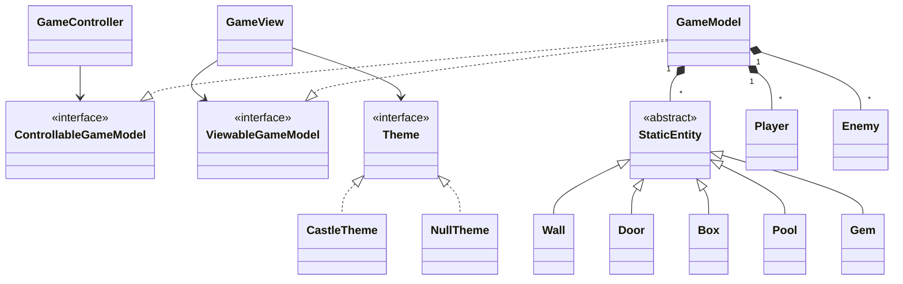

# Arkitektur

En 2D co-op platformer (Fireboy & Watergirl) bygget med Java 25, Maven og
Swing. Koden følger et **Modell–View–Controller**-mønster. De tre lagene
snakker bare med hverandre gjennom grensesnitt.

## Pakkestruktur

```
inf112.fireboys
├── app                  Hovedinngangspunkt
├── controller           Input og game loop
├── coordinateSystem     Verdityper (Position, Board, Decoration)
├── model                Spilltilstand, fysikk, lasting av nivå
│   ├── entity           Vegger, dører, bokser, gems, pools, ...
│   ├── enemy            Fiende-AI
│   └── player           Player-klasse og grensesnitt
└── view                 Swing-rendering
    └── theme            Utbyttbare visuelle tema
```

## Lagansvar

| Lag | Hovedklasse | Ansvar |
|-----|-------------|--------|
| Modell | `GameModel` | Holder spilltilstanden og kjører fysikk og kollisjoner |
| View | `GameView` | Swing `JPanel` som tegner modellen med `Graphics2D` |
| Kontroller | `GameController` | Leser tastaturinput og kjører 60 FPS game loop |

Kontrolleren kaller `clockTick()` hver frame. Modellen oppdaterer verden,
og så tegner viewet på nytt basert på det modellen eksponerer gjennom
`ViewableGameModel`.

## Grensesnitt mellom lag

Modellen importerer aldri view- eller kontroller-klasser, og motsatt vei.
All kommunikasjon går gjennom disse to grensesnittene:

- **`ControllableGameModel`** — metodene kontrolleren kaller
  (`movePlayerLeft`, `playerJump`, `menuSelect`, ...).
- **`ViewableGameModel`** — read-only data som viewet leser
  (`getPlayers`, `getBoard`, `getGameState`, `getWinFadeProgress`, ...).

`GameModel` implementerer begge.

## Klassediagram



## Designmønstre

- **MVC** — `GameModel`, `GameView` og `GameController` holdes adskilt og
  møtes kun gjennom `ControllableGameModel` og `ViewableGameModel`.
- **Template Method** — `StaticEntity.whenContact()` er det felles
  inngangspunktet for kollisjoner. Hver subklasse fyller inn sin egen
  `contactAction()` (for eksempel `Door.setOpen(true)` eller å markere en
  `Gem` som samlet).
- **Abstract Factory** — `Theme`-grensesnittet returnerer et sett med
  sprites og farger som hører sammen. Bytt `CastleTheme` med `NullTheme`
  (eller et annet tema) i `GameView`-konstruktøren, og hele utseendet endres.
- **Records som verdityper** — `Position`, `Board` og `Decoration` er
  immutable Java records.

---

*AI (Claude) ble brukt til å designe strukturen og formatet på denne filen.
Innholdet er kontrollert og tilpasset av gruppen.*
